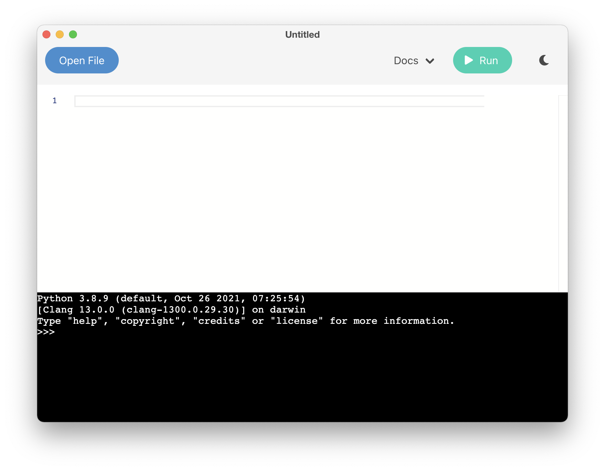

# Codey

[](https://github.com/Liamohara/Codey/actions/workflows/build_release.yml)

> A simple, no-nonsense Python IDE.



---

## Get Started

Download the latest [Release](https://github.com/Liamohara/Codey/releases/tag/latest)!

&nbsp;

## Contribute

All contributers welcome! Just make a pull request and I will review it shortly.

### Download Repo

Clone this repo to a folder on your device. Here we'll use `$HOME/codey`(MacOS/Linux)

```sh
git clone https://github.com/Liamohara/Codey.git "$HOME/codey"
```

### Install

1. Ensure that [Node.js](https://nodejs.org/en/download/) is installed.
2. Open the directory where you have installed the source code.

```sh
cd $HOME/codey
```

3. Install the dependencies.

```sh
yarn
```

4. Run Codey.

```sh
yarn start
```

5. Package the application and create the installer.

```sh
yarn make
```

6. The installer has now been saved to `./out/make`!

```sh
cd $HOME/codey/out/make
ls
```
